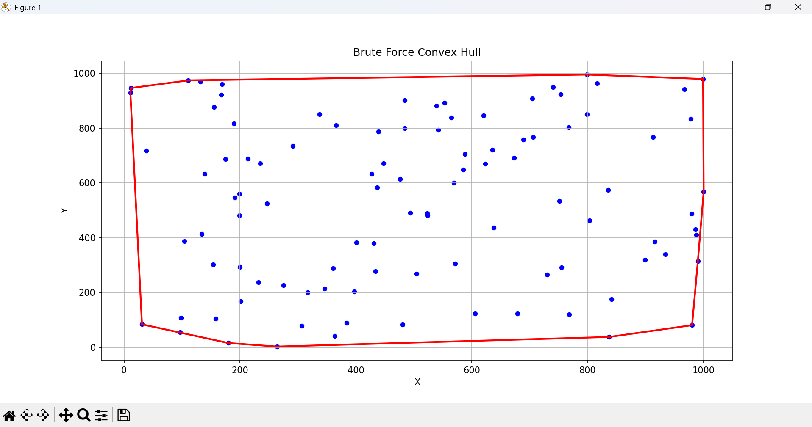
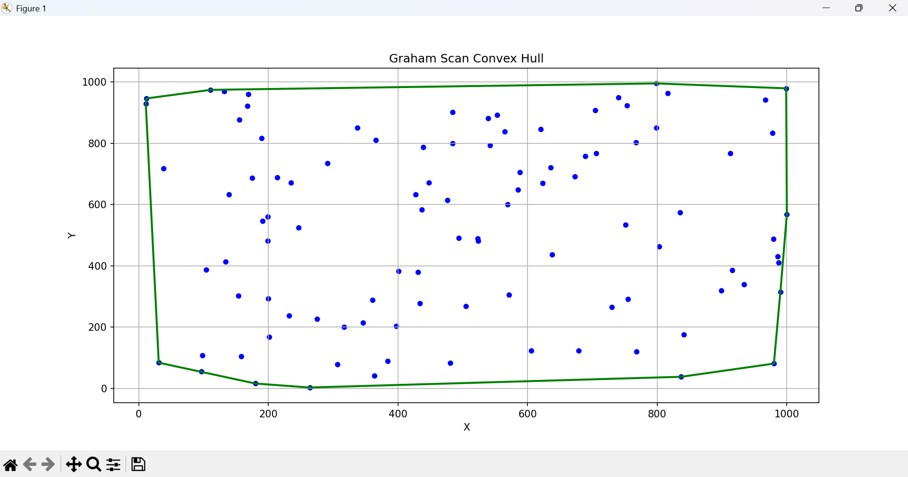

# Convex Hull Analizi: Brute Force ve Graham Scan

Bu proje, düzlemdeki noktaların dışbükey gövdesini (Convex Hull) bulmak için **Kaba Kuvvet (Brute Force)** ve **Graham Scan** algoritmalarını uygulayarak teorik ve deneysel analiz yapmayı amaçlamaktadır. Projede hem algoritmaların çalışma mantığı hem de performans karşılaştırmaları ele alınmıştır.

## Algoritmaların Özeti

### 1. Kaba Kuvvet (Brute Force)
- Tüm nokta çiftleri potansiyel kenar adayı olarak değerlendirilir.
- Her doğru adayı için diğer tüm noktalar test edilir.
- **Teorik zaman karmaşıklığı:** O(N³)
- Pratikte, nokta sayısı arttıkça çalışma süresi hızla yükselir ve büyük veri setlerinde uygulanabilirliği sınırlıdır.

### 2. Graham Scan
- En alt/sol nokta seçilir, diğer noktalar bu noktaya göre açısal olarak sıralanır.
- Yığın (stack) kullanılarak dış çerçeve oluşturulur.
- Gereksiz kenar adayları baştan elenir.
- **Teorik zaman karmaşıklığı:** O(N log N)
- Pratikte, nokta sayısı artsa bile çalışma süresi kontrollüdür ve büyük veri setlerinde kullanılabilir.

## Deneysel Sonuçlar

- Algoritmalar aynı rastgele nokta kümeleri üzerinde çalıştırılmıştır.
- **Brute Force**, nokta sayısı arttıkça süreyi hızla artırırken, **Graham Scan** daha istikrarlı bir performans göstermektedir.
- Deneysel bulgular teorik karmaşıklık analizleriyle uyumludur.

### Karşılaştırma Grafiği

### Örnek Nokta Kümeleri

## Kullanım
1. Kodları çalıştırmak için Python 3.x gereklidir.
2. `main.py` veya ilgili dosya üzerinden nokta kümeleri oluşturulup her iki algoritma çalıştırılabilir.
3. Çıktılar, grafikler ve dışbükey noktalar terminal veya görselleştirme kütüphanesi ile görüntülenebilir.

